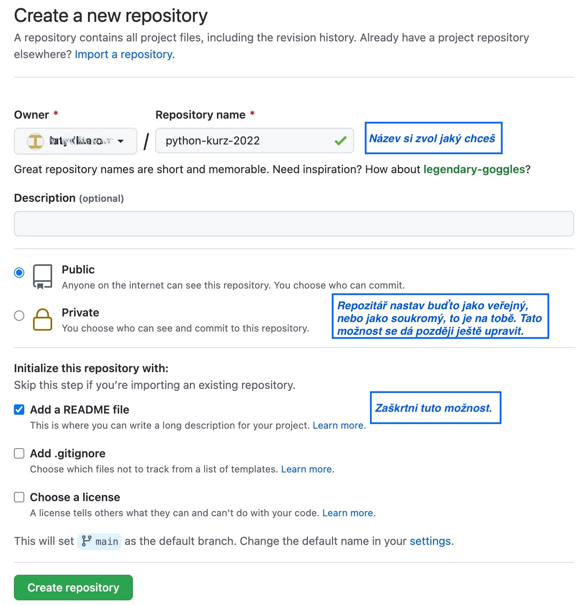
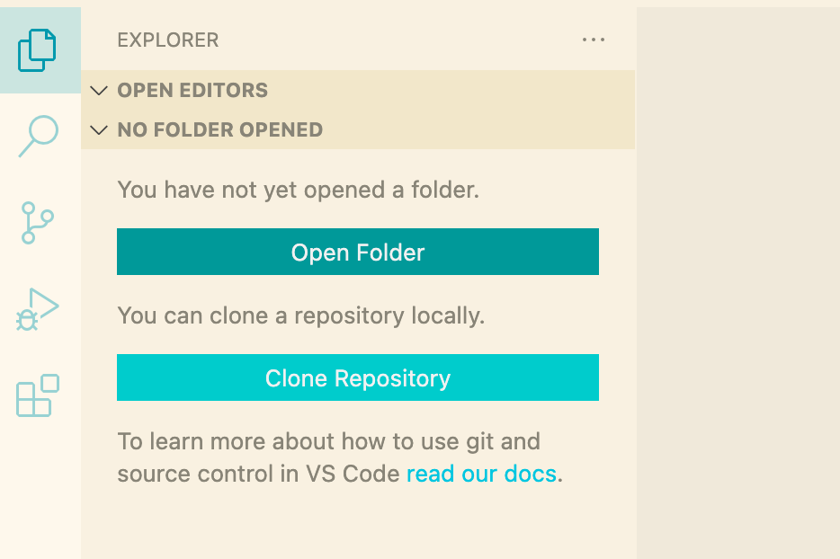
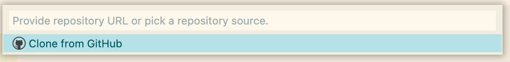
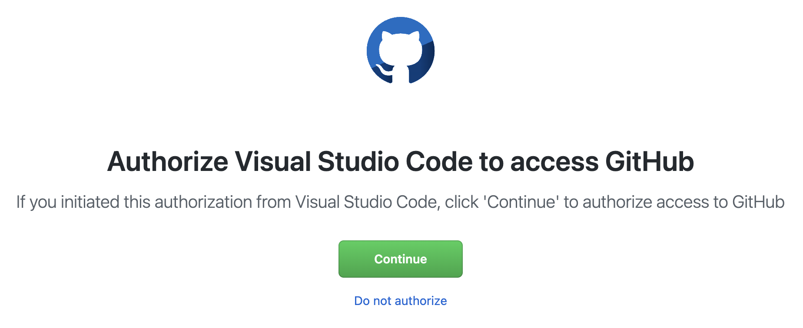

# Jak na GitHub a odevzdávání úkolů

## Vytvoření repozitáře

1. V první řadě je potřeba si vytvořit účet na stránce [github.com](https://github.com/). K tomu by měla stačit e-mailová adresa a nějaké uživatelské jméno. Pokud už na GitHubu účet máš, nemusíš si zakládat nový.

2. Přihlaš se do svého účtu a vytvoř si nový repozitář kliknutím na symbol `+` v pravém horním rohu:

3. V dialogu vytváření repozitáře postupuj podle obrázku a na závěr potvrďte stisknutím zeleného tlačítka *Create repository*:

## Přidání kouče do repozitáře

1. Na stránce tvého repozitáře (url by mělo vypadat jako `github.com/<uzivatelske-jmeno>/<nazev-repozitare>`) přejdi do nastavení klimnutím na *Settings*, a dále pak v levé liště klikni na *Manage Access* a pak na *Invite a collaborator*:

2. Otevře se okno, do kterého zadej uživatelské jméno tvého kouče (viz tabulka koučů a jejich uživatelských jmen). Výběr potvrď.

## Jak propojit repozitář na GitHubu s VS Code

1. Otevři VS Code. Klikni na ikonu papírů v levé liště a pak na *Clone Repository*

2. Klikni na *Clone from GitHub*:

3. V prohlížeči potvrď autorizaci a případně zadej své GitHub přihlašovací údaje:

