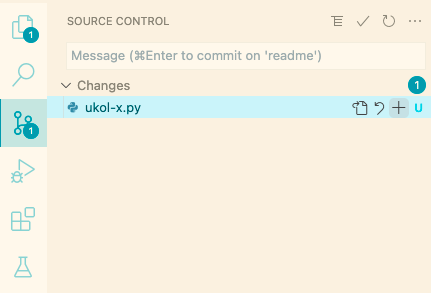
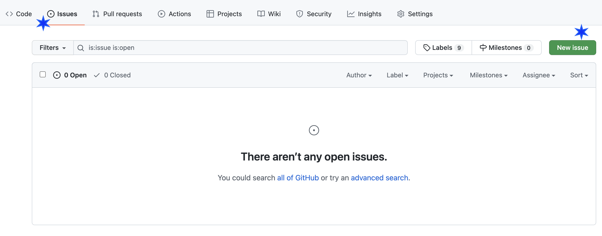
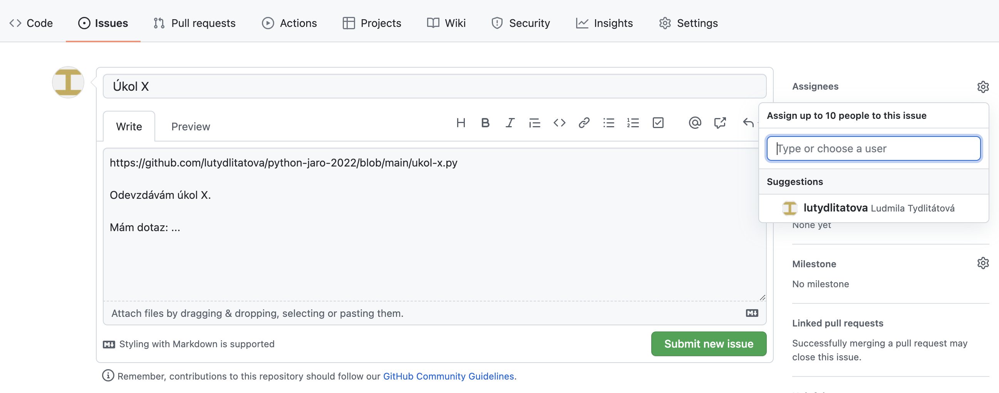

# Jak na GitHub a odevzdávání úkolů

## Jak na GitHub

### Vytvoření repozitáře

1. V první řadě je potřeba si vytvořit účet na stránce [github.com](https://github.com/). K tomu by měla stačit e-mailová adresa a nějaké uživatelské jméno. Pokud už na GitHubu účet máš, nemusíš si zakládat nový.

2. Přihlaš se do svého účtu a vytvoř si nový repozitář kliknutím na symbol `+` v pravém horním rohu:

3. V dialogu vytváření repozitáře postupuj podle obrázku a na závěr potvrďte stisknutím zeleného tlačítka *Create repository*:

### Jak propojit repozitář na GitHubu s VS Code

1. Otevři VS Code. Klikni na ikonu papírů v levé liště a pak na *Clone Repository*

2. Klikni na *Clone from GitHub*:

3. V prohlížeči potvrď autorizaci a případně zadej své GitHub přihlašovací údaje:

4. Při návratu do VS Code by teď mělo být možné vybrat tvůj repozitář. Klikni na jeho název, a vyber umístění v rámci tvého systému, kam se repozitář stáhne. Složku s repoitářem můžeš rovnou otevřít (možnost *Open*).

## Odevzdávání úkolů
Jakmile máme vytvořený repozitář na GitHubu a jeho kopii ve VS Code, můžeme nahrávat úkoly a posílat je koučům.

### Přidání kouče do repozitáře

1. Na stránce tvého repozitáře (url by mělo vypadat jako `github.com/<uzivatelske-jmeno>/<nazev-repozitare>`) přejdi do nastavení kliknutím na *Settings*, a dále pak v levé liště klikni na *Manage Access* a pak na *Invite a collaborator* (tlačítka jsou označeny modrými hvězdičkami):

2. Otevře se okno, do kterého zadej uživatelské jméno tvého kouče (viz tabulka koučů a jejich uživatelských jmen). Výběr potvrď.

### Vytvoření souboru s úkolem a nahrání na GitHub

1. Ve Visual Studiu vypracuj úkol jako soubor s příponou `.py`, například `ukol-x.py`.

2. Klikni na levé liště na obrázek "větví" (*Source Control*). V sekci *Changes* by se měl nacházet tvůj soubor.

3. U souboru, který chceš nahrát, klikni na znamení `+`. Soubor se přesune do sekce *Staged Changes*.

4. Nyní dáme znamení, že to myslíme vážně, a provedeme takzvaný *commit*. Klikni na ikonu fajfky. Nahoře v prostřed okna s Visual Studiem se objeví dialog, do kterého napiš krátké shrnutí - například *Úkol č. X* a stiskni Enter.

5. Na závěr nahrajeme tuto změnu na GitHub. Klikni na obrázek dvou šipek v cyklu zcela dole a vlevo.

### Vytvoření Issue na GitHubu

1. Na GitHubu na stránce tvého repozitáře klikni na *Issues* a pak vytvoř nové Issue pomocí tlačítka *New Issue* (tlačítka jsou označeny modrými hvězdičkami).

2. Do názvu zadej číslo úkolu, například *Úkol 2*. Do popisku zadej odkaz na soubor s tvým úkolem a případný komentář nebo dotazy. Pak zadej kouče v sekci *Assignees* kliknutím na ozubené kolečko, aby koučovi nebo koučce přišlo upozornění, že je odevzdaný nový úkol. Akci dokončíš kliknutím na *Submit new issue*. Hotovo! :tada:

